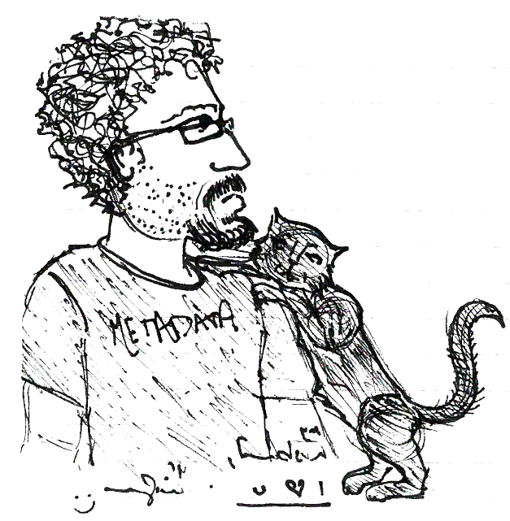

A markdownedly brutalist portfolio
==================================

Andreas "Dre" Orphanides is Associate Head, User Experience at the North Carolina State University Libraries. His work focuses on discovery systems, wayfinding, and interaction design. Areas of research interest include systems analysis and design ethics.

Dre uses a potato phone and doesn't really do social media, which

## User experience design work

### D. H. Hill construction signage (2018-present)

In 2019 and 2020, D. H. Hill Library will be undergoing a major renovation that will disrupt 2-4 floors of the 11-floor building; this project aims to minimize space and service disruption and communicate the positive outcomes of the construction project through signage and web presence. This project is in the early planning/conceptual stages. Dre is co-manager on this project.

* something
* something

### D. H. Hill wayfinding signage update (2018-present)

The D. H. Hill Library is a particularly complex building formed by "gluing" together four separate construction projects built over a span of nearly 50 years; wayfinding paths have historically been particularly problematic for this reason. The goal of this project is to enhance wayfinding and overall user experience in D. H. Hill Library through design and implementation of analog and digital signage. Dre's contributions include initial large-format signage designs, kiosk and signage location planning, overall project management. This project is in the early planning/conceptual  stages.

* Ground floor
* East wing path
* West wing path

### TRLN Discovery (2017-present)

The TRLN Discovery project is a consortial online library catalog, integrating the collections of Duke, UNC, NC Central, and NC State Universities. Dre is the lead UX designer on the developer team; he supervises and steers project UX development through all project phases, including prioritizing user interface design choices in consultation with stakeholders and developers; integrating desired functionality into the wireframe; and providing interface and interaction design input on application as a whole. This project is in late alpha.

* Dre's wireframe
* Current design

### Meeting room control panel interface (2017)

A project to revise existing room-control panel, integrating existing functionality into a more consistent and coherent design, and to develop a design that could be modularized to be used for multiple meeting rooms with varying technology. Dre designed the interface through the wireframe stage, providing additional feedback and quality assurance on the design treatment and implemented version.

* Original design
* Dre's commentary
* Dre's wireframe
* Design treatment

### How Do You Talk To a Building? Patron-facing tools for space and service discovery at the D.H. Hill Library (2016)

A strategic initiative with a goal of enhancing patron-facing information at D. H. Hill Library, to ensure that patrons received in-building space and service information in a manner that was timely, relevant, and easy to comprehend. Dre was project lead.

* [Presentation at UXLibs II Conference (2016)](https://docs.google.com/presentation/d/1mFBAnQjX8l3PDYyZnct4f7j3Aeej19FMF4u4L_uXYnM/edit?usp=sharing)

### Study room control panel interface (2016)

A project to evaluate and revise proposed room-control panel interface for Hunt Library group study rooms. Dre revised the provided comp and developed a new interface through the wireframe stage, providing additional feedback and quality assurance on the design treatment and implemented version.

* Comp provided by client
* Dre's feedback
* Dre's wireframe
* Design treatment

## Videos and graphics

### Mid-South Fencers' Club Longsword Program logo (2017)

Dre is the lead instructor (and, as it turns out, lead designer) for Mid-South Fencers' Club's longsword program. His goal in this project was to create a design appropriate for multiple applications (program logo, t-shirt design, club banner) to represent the program, highlighting the club's Durham heritage and integrating the idea of the longsword into the logo.

* [Dre's final design](./images/msfc-longsword.png)

### *One Perfect Source?* instructional video

A tutorial video for freshman college students, created for the NCSU Libraries instruction program. "Your topic seemed so great! So why can't you find any information on it? If you're looking for an all-in-one source that addresses your topic perfectly, you might need a different approach." Dre's role: Writing, editing, audio production, cat consultant

* [One Perfect Source?](https://www.youtube.com/watch?v=X2VR5adTjeM)

### *Peer Review in 3 Minutes* instructional video

A tutorial video for freshman college students, created for the NCSU Libraries instruction program. "How do articles get peer reviewed? What role does peer review play in scholarly research and publication?" Dre's role: Project co-lead, writing, editing

* [Peer Review in 3 Minutes](https://www.youtube.com/watch?v=rOCQZ7QnoN0)

### *Teach yourself: a more sustainable e-learning framework for first-year instruction* video "virtual poster"

Virtual poster submission for ACRL 2015 conference. "In 2011, our three-librarian instruction team undertook a comprehensive
review and redesign of our online tutorial, with the goals of improving its curricular foundation, its technological underpinnings,
and its sustainability, culminating in the “Teach Yourself” suite of instructional modules. This virtual poster presents our impetus
for creating a new tutorial platform, the functional requirements we identified, and the features of our new framework. We also touch
on evaluation and plans for future improvement." Dre's role: Project co-lead, design, development, editing

* [Teach yourself: a more sustainable e-learning framework for first-year instruction](https://www.youtube.com/watch?v=S5LXaaPqJUc)

### *From Idea to Library* instructional video (2013)

A tutorial video for freshman college students, created for the NCSU Libraries instruction program. "Where do research articles come from? How do they end up in your search results? This video has the answers." Dre's role: Project lead, writing, editing, storyboarding

* [From Idea to Library](https://www.youtube.com/watch?v=jaZUAHxSb9k)

### *Anatomy of a Scholarly Article* interactive tutorial (2009)

An interactive tutorial highlighting the parts of a scholarly article, and the purpose and significance of each part. Although the definition of "peer reviewed article" is quite subtle, a college freshman will typically identify one taxonomically. This tutorial is meant to facilitate that sort of identification. Dre designed, developed, and implemented this tutorial from the ground up.

* [Anatomy of a Scholarly Article](http://www.lib.ncsu.edu/tutorials/scholarly-articles/)

## Other Presentations and Publications

### Systems thinking: a practical field guide (2018)

Presentation at the Code4Lib 2018 conference. An introduction to reading and analyzing systems in the wild, with an emphasis on unpacking a system's key features starting with scant information.

* [Video](https://youtu.be/lH0SW_0n7Uc?t=4798)
* [Slide deck](https://docs.google.com/presentation/d/1yWWNgq-qCNd4vRZ1-ciWXhSndpPIbRrqFsz5pQ5kHtk/edit)

### Touchscreen interfaces in context (2017)

AK Orphanides, CS Nam. (2017). Touchscreen interfaces in context: a systematic review of research into touchscreens across settings, populations, and implementations. *Applied Ergonomics* 61.

* [Full article](./images/touchscreen-ergonomics.pdf)

### It's made of people: designing systems for humans (2017)

Invited keynote presentation at the Code4Lib 2017 conference. We rely on systems in our day-to-day work, but systems are at best flawed representations of our own work and our customers' goals. How do we ensure that our system is effective and friendly to the human actors in light of their inherent limitations?

* [Video](https://docs.google.com/presentation/d/1U0_D6CU-VdxnCzKdDBaGVI_EVxqMCJ-cqoX45pMrAGQ/edit?usp=sharing)
* [Slide deck](https://www.youtube.com/watch?v=eUArNAG-CY4&feature=youtu.be&t=3661)

### Architecture is politics: the power and the perils of systems design (2016)

Presentation at the Code4Lib 2016 conference. As the designers and implementers of complex systems (such as websites, discovery tools, and knowledge repositories), we have great -- if sometimes unrealized -- power. And, as Stan Lee says, with great power comes great responsibility.

* [Video](https://youtu.be/P03kD_Q5qcU?t=2315)
* [Slide deck](https://docs.google.com/presentation/d/180dMBG26xMYB9gfIotoUyCBQfO3XfmHiJGQjvn58GwY/edit?usp=sharing)
